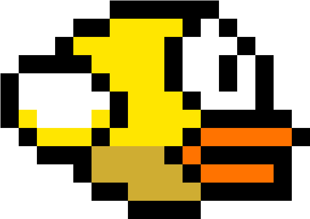

# Flappy Bird 
- [Introduction](#introduction)
- [How it works](#how-it-works)
- [Resources](#resources)
## Introduction
Flappy Bird is a classic mobile game created by [Dong Nguyen in 2013](https://en.wikipedia.org/wiki/Flappy_Bird). The objective is to guide our cute little bird on an endless journey without hitting the pipes and falling to its death.  
## How it works
**Note:** Please make sure to have pygame and python interpreter installed.  
Player Movement - Press ***Space*** to flap the wings and fly 
upward    
Notable Game Mechanics:
- **Pipes** - randomly spawned to the right and move left to create an illusion of bird flying forward (to the right)
- **Bird rotation** - rotate function as part of pygame will distort the image. Thus, bird's vector (position) after rotation must be calculated mathematically and then used to place the rotated image in such a way that distortion will not occur. 
- **Changing background, bird and pipe color** - custom user events are used to create an internal clock with which trigger the color changing on a certain time interval.
## Resources
Many thanks to [samuelcust](https://github.com/samuelcust) for his Flappy Bird assets <https://github.com/samuelcust/flappy-bird-assets.git>
